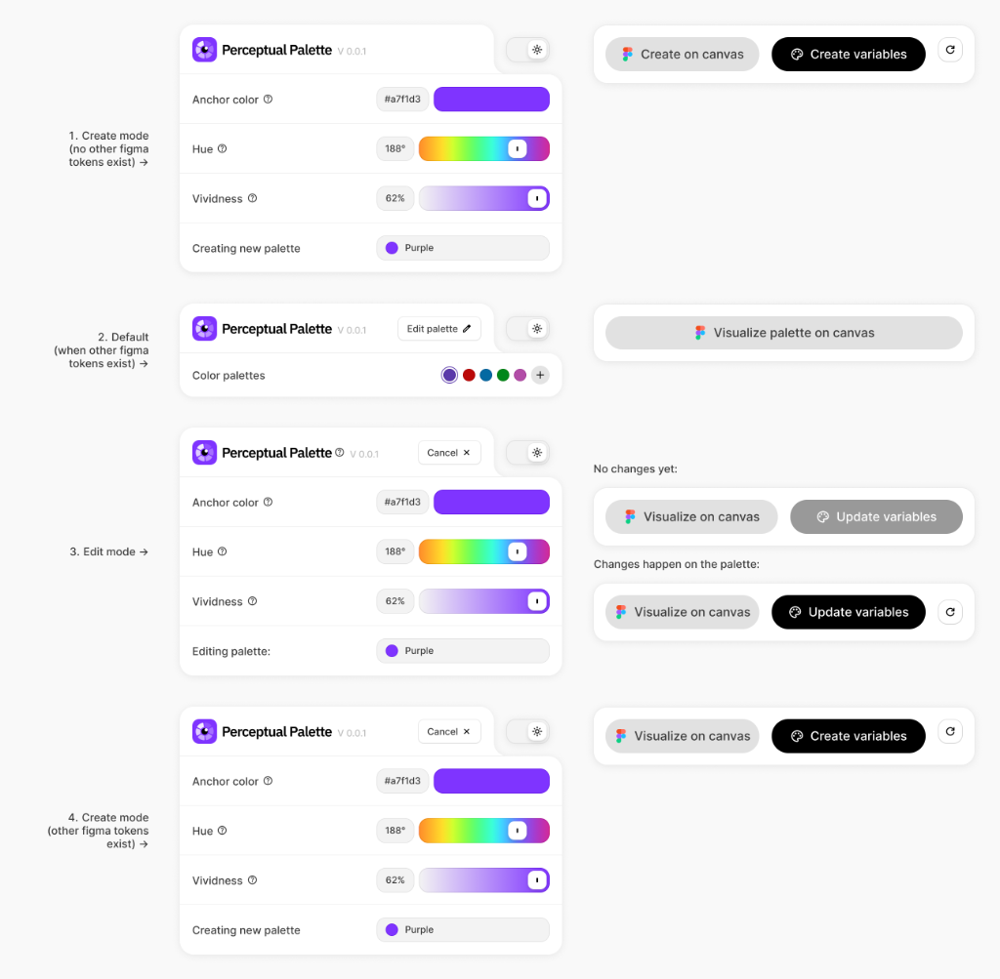

# UI Architecture & State Management

> Technical documentation of the plugin's UI states, state management, and user flows

---

## Overview

Perceptual Palette uses a centralized state management system with four distinct header states:

| State | Name | Trigger | Header Expanded |
|-------|------|---------|-----------------|
| 1 | `create-no-tokens` | No Figma variables exist | Yes |
| 2 | `default` | Variables exist, viewing | No |
| 3 | `edit` | Editing existing palette | Yes |
| 4 | `create-with-tokens` | Creating new palette when tokens exist | Yes |

### Visual Reference



*All four UI states with their corresponding header layouts and footer button configurations*

## State Management

### Core State (`StateManager`)

**Location:** [state.ts](file:///src/ui/state.ts)

The `StateManager` singleton manages all UI state:

```typescript
interface PluginState {
    // Palette Data
    baseColor: string;              // Current anchor hex color
    oklchHue: number;               // Hue slider value (0-360)
    oklchVividness: number;         // Vividness slider value (0-1)
    stops: number[];                // Active stop values [100, 200, ...]
    lastSwatches: SwatchResult[];   // Generated palette swatches
    
    // Selection & Editing
    selectedPaletteId: string | null;    // Currently selected palette name
    originalPaletteData: StopData[];     // Original data for dirty checking
    detectedPalettes: DetectedPalette[]; // All palettes from Figma
    
    // Dirty State
    isDirty: boolean;               // Has unsaved changes
    syncedState: object | null;     // Snapshot for reset/cancel
    
    // UI State
    isHeaderExpanded: boolean;      // Header expansion state
    theme: 'light' | 'dark';        // Current theme
    paletteMode: 'legacy' | 'oklch';// Algorithm mode
    overrides: Record<number, any>; // Per-stop color overrides
}
```

### Key Methods

| Method | Purpose |
|--------|---------|
| `getState()` | Get current state reference |
| `setState(updates)` | Merge updates into state |
| `commit()` | Snapshot current state as synced baseline |
| `reset()` | Restore state to last committed snapshot |
| `checkDirty()` | Recalculate `isDirty` flag |

---

## UI Header States

### State Determination Logic

```typescript
function computeHeaderState(): HeaderState {
    const { detectedPalettes, isHeaderExpanded, selectedPaletteId } = getState();
    
    if (detectedPalettes.length === 0) return 'create-no-tokens';
    if (!isHeaderExpanded) return 'default';
    if (selectedPaletteId) return 'edit';
    return 'create-with-tokens';
}
```

### State Transitions

```mermaid
stateDiagram-v2
    [*] --> default: Boot (has tokens)
    [*] --> create_no_tokens: Boot (no tokens)
    
    default --> edit: Click "Edit palette"
    default --> create_with_tokens: Click "+" button
    
    edit --> default: Click "Cancel"
    edit --> default: Click "Update variables"
    
    create_with_tokens --> default: Click "Cancel"
    create_with_tokens --> default: Click "Create variables"
    
    create_no_tokens --> default: Create first palette
```

---

## User Flows

### Flow 1: Plugin Boot (With Existing Tokens)

1. Plugin loads → `GET_PALETTES` message sent to Figma
2. Figma responds with `PALETTES_DATA`
3. UI receives palettes → stores in `detectedPalettes`
4. **Auto-selects first palette** via `selectPalette()`
5. Header state = `default` (collapsed)
6. Footer shows "Visualise palette on canvas" button

### Flow 2: Edit Existing Palette

1. User clicks "Edit palette" button (pencil icon)
2. `isHeaderExpanded` = `true`
3. `StateManager.commit()` snapshots current state
4. Header expands → shows Anchor, Hue, Vividness controls
5. Header state = `edit`
6. Footer shows: Canvas | Update variables (disabled if clean) | Reset
7. User makes changes → `isDirty` becomes `true`
8. User clicks "Update variables" → exports to Figma
9. Or clicks "Cancel" → `StateManager.reset()`, collapses header

### Flow 3: Create New Palette

1. User clicks "+" button in palette selector
2. `_isCreatingManual` flag set
3. State reset to defaults (purple, hue 297°, vividness 100%)
4. `isHeaderExpanded` = `true`
5. Header state = `create-with-tokens`
6. Footer shows: Create on canvas | Create variables | Reset
7. User clicks "Create variables" → exports to Figma
8. Or clicks "Cancel" → restores previous selection

---

## Button Behaviors

### "Edit palette" / "Cancel" Toggle Button

**Location:** [ui.ts](file:///src/ui/ui.ts) - `editPaletteToggle.onclick`

| Context | Action | Result |
|---------|--------|--------|
| View mode | Click | Expands header, commits state, enters edit mode |
| Edit mode (clean) | Click | Collapses header, selects first palette |
| Edit mode (dirty) | Click | Resets state, collapses, selects first palette |
| Create mode | Click | Clears creation flags, selects first palette |

### Footer Buttons

**Canvas Button:**
- Always enabled
- Calls `createSelectionOnCanvas()` → creates frame on Figma canvas
- Payload: `{ createVariables: false, createFrame: true }`

**Variables Button:**
- **Create mode:** Always enabled, text = "Create variables"
- **Edit mode:** Disabled when `!isDirty`, text = "Update variables"
- Calls `exportToFigma()` → creates/updates Figma variables
- Payload: `{ createVariables: true, createFrame: false }`

**Reset Button:**
- **Create mode:** Always visible
- **Edit mode:** Only visible when `isDirty`
- Calls `resetPlugin()` → reverts to initial state

---

## Global Window Functions

The following functions are exposed globally for dynamic button callbacks:

```typescript
(window as any).exportToFigma = () => { ... };
(window as any).createSelectionOnCanvas = () => { ... };
(window as any).resetPlugin = () => { ... };
```

---

## Key Files

| File | Purpose |
|------|---------|
| [ui.ts](file:///src/ui/ui.ts) | Main UI logic, event handlers, rendering |
| [state.ts](file:///src/ui/state.ts) | Centralized state management |
| [Button.ts](file:///src/ui/components/Button.ts) | Button component factory |
| [PaletteSelector.ts](file:///src/ui/components/PaletteSelector.ts) | Palette pill selector |
| [PaletteRow.ts](file:///src/ui/components/PaletteRow.ts) | Individual swatch row |
| [index.html](file:///src/index.html) | HTML structure and layout |
| [ui.css](file:///src/ui/ui.css) | Styles and state-based visibility |

---

## CSS State Selectors

The body element receives `data-header-state` and `data-ui-state` attributes:

```css
/* Header state-based visibility */
[data-header-state="default"] .expandable-container { display: none; }
[data-header-state="edit"] .btn-text-edit { display: none; }
[data-header-state="edit"] .btn-text-cancel { display: inline; }

/* UI state-based styling */
[data-ui-state="create-no-tokens"] .palette-menu { display: none; }
[data-ui-state="edit"] .footer-row { /* multi-button layout */ }
```

---

## Tooltip System

**Location:** [ui.ts](file:///src/ui/ui.ts) - lines 63-130

The global tooltip system uses hover tracking to maintain visibility when moving between trigger and tooltip:

```typescript
let isOverIcon = false;
let isOverTooltip = false;

const maybeHideTooltip = () => {
    if (!isOverIcon && !isOverTooltip) {
        // Schedule hide after 100ms delay
    }
};
```

This allows users to click links within tooltips without the tooltip disappearing.

---

## Message Protocol

### UI → Figma

| Type | Payload | Purpose |
|------|---------|---------|
| `GET_PALETTES` | — | Request existing palettes |
| `EXPORT_TO_FIGMA` | `FigmaExportPayload` | Create/update palette |
| `NOTIFY` | `{ message: string }` | Show toast notification |
| `RESIZE_UI` | `{ width, height }` | Request UI resize |

### Figma → UI

| Type | Payload | Purpose |
|------|---------|---------|
| `SET_BASE_COLOR` | `{ hex: string }` | Set anchor from selection |
| `PALETTES_DATA` | `{ palettes: DetectedPalette[] }` | Sync detected palettes |

---

## Testing Checklist

- [ ] Boot with no tokens → creation mode visible
- [ ] Boot with tokens → first palette auto-selected
- [ ] Edit palette → header expands
- [ ] Cancel without changes → returns to view mode
- [ ] Cancel with changes → reverts and returns to view mode
- [ ] Update variables → syncs with Figma
- [ ] Create new palette → proper creation flow
- [ ] Buttons disabled/enabled appropriately
